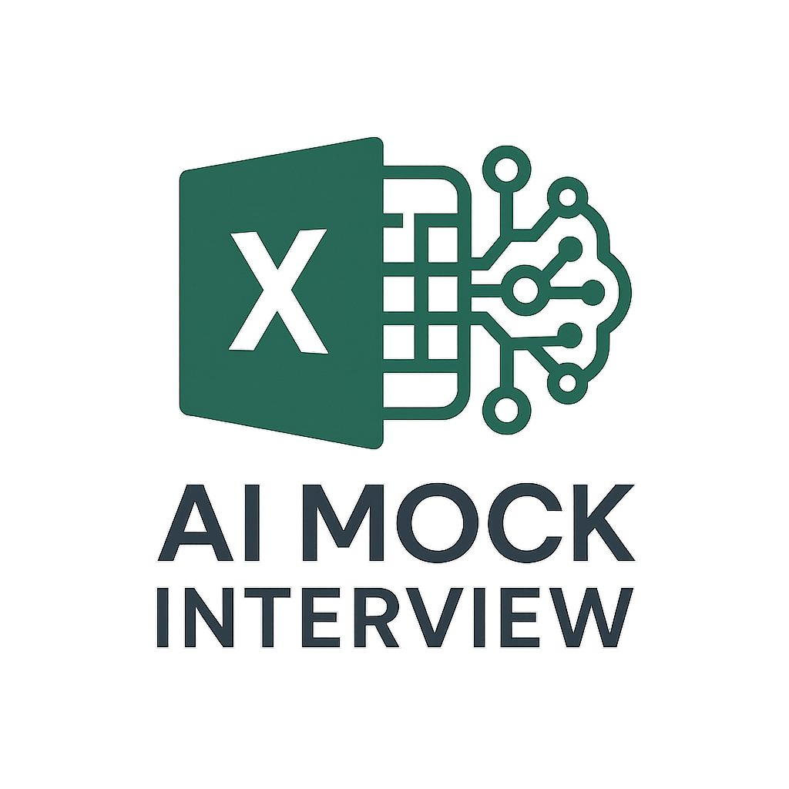

# AI-Powered Excel (and Beyond) Mock Interviewer

A production-grade mock-interview platform that blends generative AI with a curated question bank to prepare candidates for-oriented roles.

🎯 Experience it in Action
🔗[Live Demo](https://ai-mock-interviewer-1.streamlit.app/)



## 🚀 Key Features

|  |  |
| :-- | :-- |
| ✨ **Adaptive LLM Interviews** – GPT-4o tailors follow-ups in real time | 🧠 **Vector-Ranked Questions** – FAISS + SentenceTransformers for semantic matching |
| 📑 **PDF Feedback Reports** – strengths, gaps \& rubric scores | 🔍 **Clarification Bot** – policy vs. knowledge queries auto-routed |
| 🌐 **Multi-Provider** – OpenAI / Groq / custom BASE_URL  | 🛠️ **Admin Panel** – logs, traces \& dataset curators |

## 💡 Motivation \& Impact

Interview practice is expensive, repetitive, and often generic. By combining retrieval-augmented generation with rubric-based scoring, this project lowers coaching costs, surfaces domain-specific blind spots, and scales to thousands of simultaneous candidates without sacrificing quality.


## ⚙️ Tech Stack

* **Frontend**: Streamlit 1.35, st-markdown badges.
* **LLMs**: OpenAI GPT-4o, Groq API compatible via `BASE_URL`(default).
* **Embeddings**: SentenceTransformers `all-MiniLM-L6-v2`.
* **Vector DB**: FAISS IVF-HNSW with on-disk persistence.
* **Reports**: FPDF + Jinja2 templates → PDF.co pipeline for charts.
* **Infra**: Streamlit Community Cloud deploy, GitHub Actions CI/CD.


## 🔁 End-to-End Workflow

1. **Login** ↔ Clerk.
2. **Interview Loop** – LLM asks → user answers → LLM follows-up.
3. **Rubric Scoring** – GPT-4o or Groq API scores across Accuracy, Depth, Clarity.
4. **PDF Report** generated, stored and emailed.
5. **Admin Review** – gemstone logs, alert tags.

## 📦 Folder Structure

```text
ai-excel-mock-interviewer/
├─ app.py                 # Entry-point
├─ interview/
│  ├─ chains.py           # Q-engine & ranking
│  └─ reports.py          # Report builder
├─ data/
│  ├─ questions.csv       # Tagged Q&A
│  └─ alert.json          # Alert logs
├─ admin/
│  └─ dashboard.py        # Sidebar admin logic
├─ requirements.txt       # Module dependencies
└─  reports/              # Log Reports(Local & GitHub: persistent; Streamlit Cloud: ephemeral)
```


## 🛠️ Installation

```bash
# 1. Clone
git clone https://github.com/your-handle/ai-excel-mock-interviewer.git
cd ai-excel-mock-interviewer

# 2. Create env
python -m venv .venv && source .venv/bin/activate
pip install -r requirements.txt

# 3. Set secrets
cp .env.example .env  # add OPENAI_API_KEY etc.

# 4. Run locally
streamlit run app.py
```


### 🚀 One-Click Deploy (Streamlit Cloud)

1. Fork this repo.
2. In Streamlit Cloud → *New App* → select `app.py`.
3. Add secrets in **⚙️ Settings → Secrets**.

## 🧪 Usage

```text
1. Open http://localhost:8501
2. Click “Start Mock Interview”
3. Type answers
4. Download PDF or share link
```

## 🔒 Environment Variables

| Key | Purpose |
| :-- | :-- |
| `OPENAI_API_KEY` | LLM requests |
| `BASE_URL` | Alternate LLM proxy |
| `STREAMLIT_CLOUD_URL` | Callback links |
| `SMTP_SERVER` / `SMTP_PASS` | Email reports |

Secrets can be stored in `.env` (dev) or `st.secrets` (prod).

## 📈 Scaling Roadmap

- [ ] **Ollama / Local LLM** fallback.
- [ ] **Skill Graph Embeddings** for longitudinal growth.
- [ ] **Celery + RQ** background queues.
- [ ] **Multi-tenant DB \& Stripe Billing**.
- [ ] **GDPR “Right-to-Delete” Endpoint**.


## 🤝 Contributing

1. Fork → feature branch → PR.
2. Ensure `pytest` \& `black` pass.
3. Describe interview domain additions clearly.

## 📬 Contact \& Support

- 📧 **Email**: [aalok2kamboj@gmail.com](mailto:aalok2kamboj@gmail.com)
- 💼 **LinkedIn**: [Aalok Kumar](https://www.linkedin.com/in/aalok-kumar-82754a14b/)


---

<div align="center">

### **⭐ If you found this project helpful, please give it a star! ⭐**

**🚀 Ready to transform the way mock interviews are conducted? Get started now!**

---

***"The future of interview process is AI-driven — and it's here to test you!"*** 🤖🎯

</div>

---

<div align="center">

**Made with ❤️ by Aalok Kumar**  
**© 2025 - All Rights Reserved**

</div>